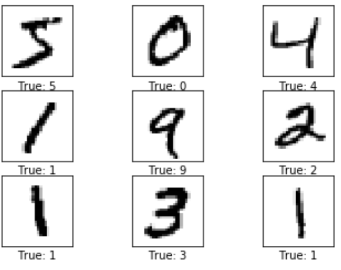
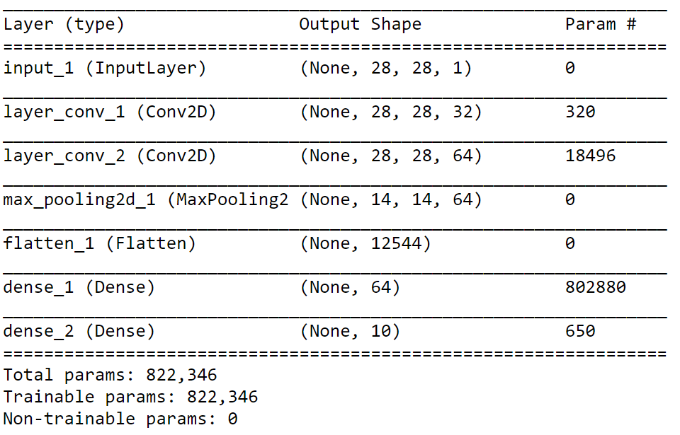
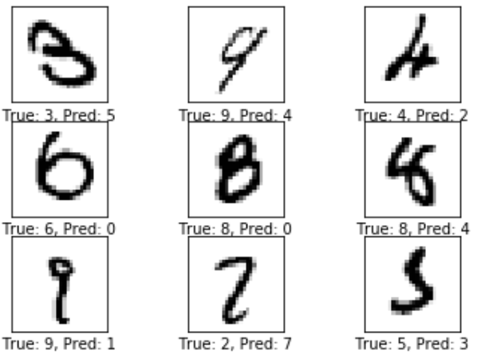
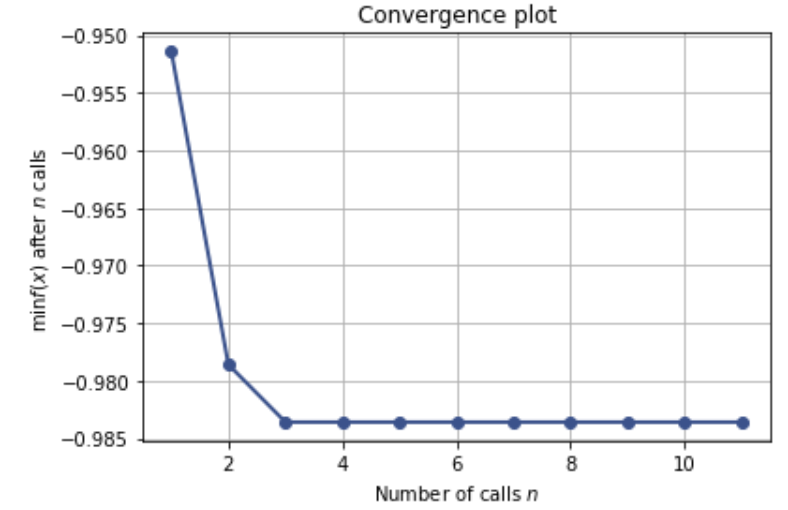

# Mnist-Image-Recognition
> This is a python notebook to teach how to implement a basic CNN model for MNIST dataset. It contains 28x28 black and white handwritten digit data from 0 to 9.

This is a python notebook to teach how to implement a basic CNN model for MNIST dataset. It contains 28x28 black and white handwritten digit data from 0 to 9.

Research Question:

### Visualization of CNN model

Here is the screenshot of the output of model.summary().

## Images that can not be recognized correctly

## Results(accuracy)

